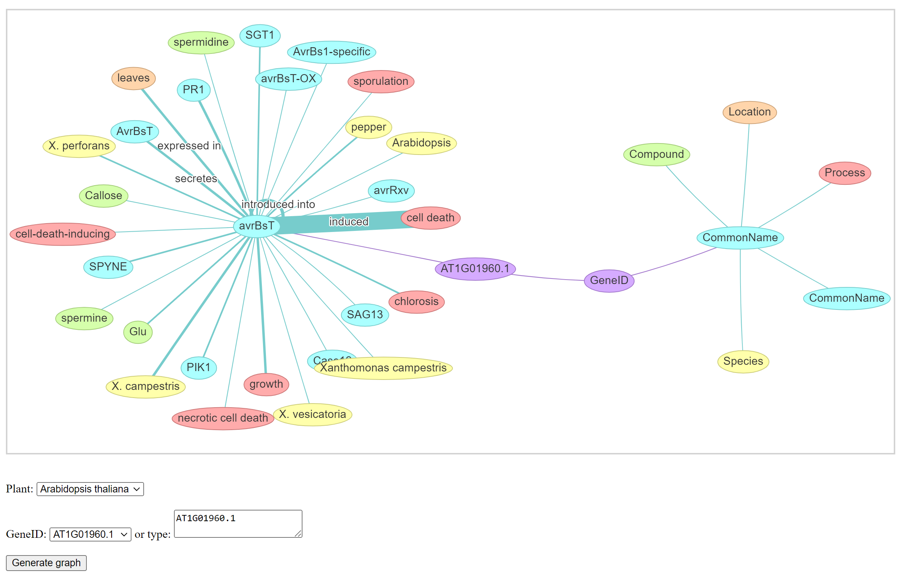

# GeneID-CommonName-Relation Visualization

#### A visualization tool for displaying GeneID-CommonName-relations in literature extracted by ORE

## Dataset

- Sci-Hub -> Papers

| PDF-to-text | &nbsp;&nbsp;&nbsp;&nbsp;&nbsp;&nbsp;&nbsp;&nbsp;# |
| :-- | --: |
| PDF files   |     253,390 |
| Text files  |     252,407 |
| Sentences   | 105,884,274 |

- Papers -> NER

| Type | &nbsp;&nbsp;&nbsp;&nbsp;&nbsp;&nbsp;&nbsp;# |
| :-- | --: |
| CommonName | 23,838,373 |
| Species    | 21,944,100 |
| Location   | 16,978,733 |
| Compound   | 14,425,577 |
| Process    | 12,725,532 |

- Plant -> Gene ID -> Common Name -> Entity Relations

| Type | &nbsp;&nbsp;&nbsp;&nbsp;&nbsp;# |
| :-- | --: |
| Plant            |       2 |
| GeneID           |   1,889 |
| CommonName       |   2,139 |
| Entity Relations | 148,606 |

## Development Environment

- Python 3.6.9

| Package | Version |
|-|-|
| Flask | 3.6.9 |

## Usage

### 1. Start the web server

```bash
python server.py --host 0.0.0.0 --port 12345
```

- Uses ~1 GB of memory
- Listening on IP addresses: all
- Listening on port: 12345

### 2. Connect to the website

Open web browser and connect to

- _\[server_ip\]_:12345

When the client and the server are on the same machine:

- localhost:12345
- 127.0.0.1:12345

## Web Interface


